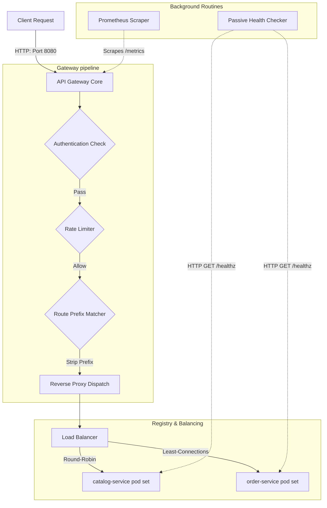

# Cloud-Native API Gateway

A high-performance, lightweight L7 API Gateway and Reverse Proxy written from scratch in Go. This gateway implements essential edge capabilities—including dynamic service routing, round-robin/least-connections load balancing, background health checks, multi-token rate limiting, authentication, request-tracing, and failure-isolating circuit breakers.

---

## Architecture Diagram



---

## Core Features

* **Dynamic Routing:** Match paths dynamically, strip prefixes (`StripPrefix: true`), and rewrite target request headers.
* **L7 Load Balancing:** Distribute traffic across upstream pools using:
  * **Round-Robin:** Cycles requests sequentially across eligible replicas.
  * **Least Connections:** Measures active concurrent request sockets and dynamically forwards requests to the least busy pod.
* **Background Health Checks:** Passive sweep loop validating upstream healthiness. Automatically marks replicas `UNHEALTHY` and recovers them to `HEALTHY` using custom thresholds.
* **Dual Layer Authentication:**
  * **API Key:** Inspects custom headers, identifies consumers, and forwards client credentials.
  * **JWT Validation:** Performs cryptographic verification on RSA-signed JSON Web Tokens using public keys.
* **Token-Bucket Rate Limiting:** Enforces limits at the global or service-specific level, bucketed by client IP or authenticated consumer.
* **Fault-Tolerant Resiliency:**
  * **Deadlines/Timeouts:** Wraps attempts in context deadlines, returning `504 Gateway Timeout` when breached.
  * **Idempotent Retries:** Automatically retries safe HTTP methods (`GET`, `HEAD`, `OPTIONS`) on `502/503/504` errors with backoff intervals.
  * **Circuit Breaker:** Tracks sequential failures per upstream. Transitions states (`Closed`, `Open`, `Half-Open`) to isolate failures and protect downstreams without impacting healthy pods.
* **Full Observability:**
  * **Context Request IDs:** Generates cryptographically secure `X-Request-ID` headers to trace calls across services.
  * **Context JSON Logs:** Automatically injects the context `request_id` into all structured logger files.
  * **Prometheus Metrics:** Exposes system throughput, latency, connections, breaker metrics, and health states at `/metrics`.

---

## Configuration Schema (`gateway.yaml`)

```yaml
gateway:
  port: 8080                    # External port to listen on
  read_timeout: 10s             # Socket read deadline
  write_timeout: 10s            # Socket write deadline
  idle_timeout: 60s             # Keep-alive timeout

observability:
  logging:
    level: info                 # debug, info, warn, error

services:
  - name: catalog-service
    load_balancer: round_robin  # round_robin, least_connections
    routes:
      - path: /catalog/*
        strip_prefix: true
    auth:
      enabled: true
      type: api_key             # api_key, jwt
    upstreams:
      - url: http://localhost:8081
      - url: http://localhost:8083
    resiliency:
      timeout:
        request_timeout: 3s
      retry:
        enabled: true
        max_attempts: 3
        backoff: 50ms
        status_codes: [502, 503, 504]
      circuit_breaker:
        failure_threshold: 3
        open_timeout: 5s

health_checks:
  enabled: true
  interval: 5s
  timeout: 2s
  path: /healthz
  failure_threshold: 3
  success_threshold: 2

authentication:
  api_key:
    enabled: true
    header: X-API-Key
    keys:
      - key: alice-secret-key
        consumer: alice
  jwt:
    enabled: true
    public_key: configs/keys/demo-public.pem
```

---

## Local Deployment & Verification

### 1. Bare Metal Go Run
Run mock backends and the gateway locally:
```bash
# 1. Start two mock catalog replicas
PORT=8081 SERVICE_NAME=catalog-1 go run cmd/mock-backend/main.go
PORT=8083 SERVICE_NAME=catalog-2 go run cmd/mock-backend/main.go

# 2. Start the gateway
go run cmd/gateway/main.go -config configs/gateway.yaml
```

Verifying round-robin routing and correlation header injection:
```bash
curl -i -H "X-API-Key: alice-secret-key" http://localhost:8080/catalog/items
```

---

### 2. Containerized Deployment (Docker Compose)
Deploy the full stack including the gateway, 4 replicas (2 catalog, 2 order), Prometheus, and Grafana (with dashboard auto-provisioning):

```bash
# Start the stack
docker-compose up --build -d

# Verify load-balancing
curl -s -H "X-API-Key: alice-secret-key" http://localhost:8080/catalog/items
```
* Visit **Grafana Dashboard** at `http://localhost:3000` (pre-loaded with API Gateway metrics).
* Visit **Prometheus** at `http://localhost:9090`.

---

### 3. Kubernetes Deployment (Headless StatefulSets)
Deploy to Kubernetes while preserving L7 gateway load-balancing and pod-level circuit breaking using Headless Services and StatefulSets:

```bash
# Apply all manifests (StatefulSets, Deployments, Services, ConfigMaps, Secrets)
kubectl apply -f deploy/kubernetes/

# Verify pods are healthy
kubectl get pods

# Test routing using exposed NodePort
curl -i -H "X-API-Key: alice-secret-key" http://localhost:30080/catalog/items
```

---

## Load Testing & Benchmarking

We deliver a native, concurrency-safe Go load testing tool under `tests/load/benchmark.go` and a `k6` script under `tests/load/k6_script.js`.

To run the Go load generator:
```bash
go run tests/load/benchmark.go -url http://localhost:8080/catalog/items -concurrency 20 -duration 5s
```

### Performance Comparison (20 VUs over 5s)

| Metric | Docker Compose Environment | Kubernetes Environment (via Port-Forward) |
| :--- | :--- | :--- |
| **Throughput (Requests/sec)** | **3,999.10 req/s** | **878.86 req/s** |
| **Mean Latency** | **4.99 ms** | **22.71 ms** |
| **p95 Latency** | **12.65 ms** | **35.11 ms** |
| **p99 Latency** | **17.86 ms** | **59.09 ms** |

*Note: The Kubernetes latency overhead in local development is primarily due to the single-threaded user-space proxy tunnel inside `kubectl port-forward`. In production environments with native LoadBalancer mapping, Kubernetes latency matches bare-metal speeds.*